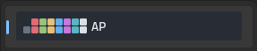
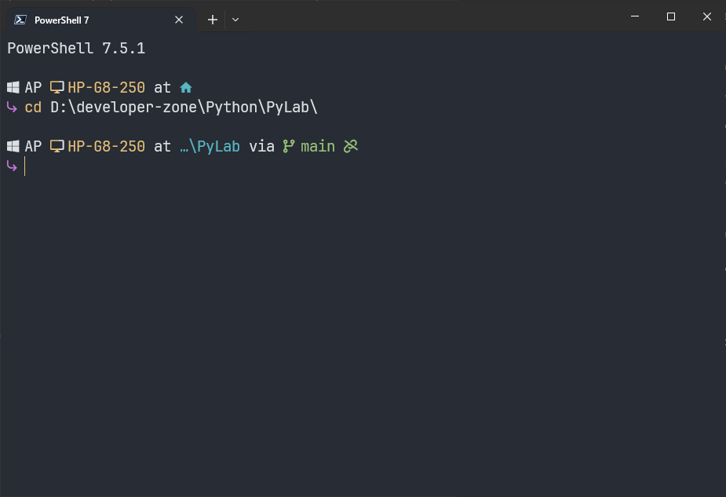

# dotfiles.AP

> 🚀 Personal dotfiles and configuration for a beautiful, productive terminal experience on Windows and Linux.

---

## Table of Contents
- [Overview](#overview)
- [Quick Start](#quick-start)
- [Folders & Index](#folders--index)
- [Screenshots](#screenshots)
- [Credits & References](#credits--references)

---

## Overview
This repository contains my curated configuration files for:
- **[Starship](./starship)**: A blazing-fast, cross-shell prompt with a custom theme and language/runtime indicators.
- **[Windows Terminal](./windows-terminal)**: A modern terminal emulator with a custom color scheme, font, and profile setup.

All configurations are optimized for developer productivity, aesthetics, and compatibility with Nerd Fonts.

---

## Quick Start
1. **Install a Nerd Font** (e.g., JetBrainsMono Nerd Font) for best symbol support.
2. **Set up Windows Terminal**
   - See [windows-terminal/README.md](./windows-terminal/README.md) for color scheme, font, and profile setup.
3. **Set up Starship Prompt**
   - See [starship/README.md](./starship/README.md) for prompt installation and configuration.

---

## Folders & Index
| Folder                                 | Description                                                      |
|----------------------------------------|------------------------------------------------------------------|
| [starship](./starship)                 | Starship prompt configuration (`starship.toml`) and usage guide. |
| [windows-terminal](./windows-terminal) | Windows Terminal settings, color scheme, and profile setup.      |
| [fastfetch](./fastfetch)               | Fastfetch configuration for system info and ASCII logo display.  |
| [fish](./fish)                         | Fish shell configuration and custom functions.                   |
| [kitty](./kitty)                       | Kitty terminal emulator settings and color schemes.              |
| [Screenshots](./Screenshots)           | Visual previews of prompt, color scheme, and terminal profiles.  |

---

## Screenshots
| Preview                                                            | Description                    |
|--------------------------------------------------------------------|--------------------------------|
|                    | AP Color Scheme                |
|  | Starship PowerShell Prompt     |

---

## Credits & References
- [Starship](https://starship.rs/)
- [Windows Terminal](https://aka.ms/terminal)
- [Nerd Fonts](https://www.nerdfonts.com/)
- [JetBrainsMono Nerd Font](https://github.com/ryanoasis/nerd-fonts)

---

> _Feel free to fork, adapt and use these configs for your own workflow!_
