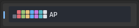
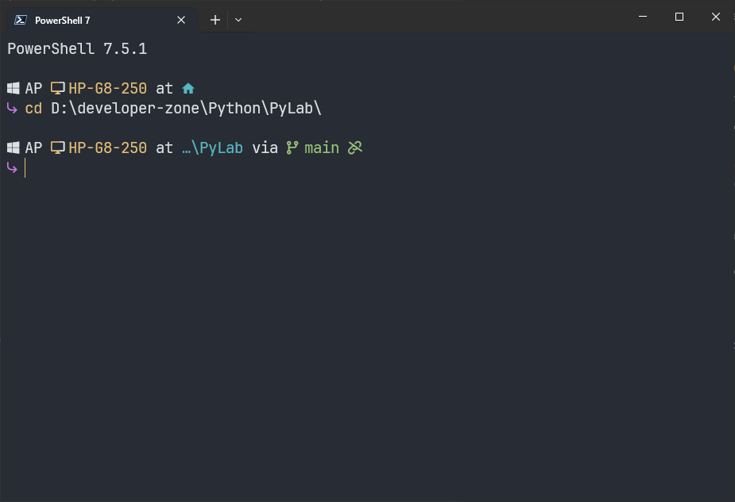
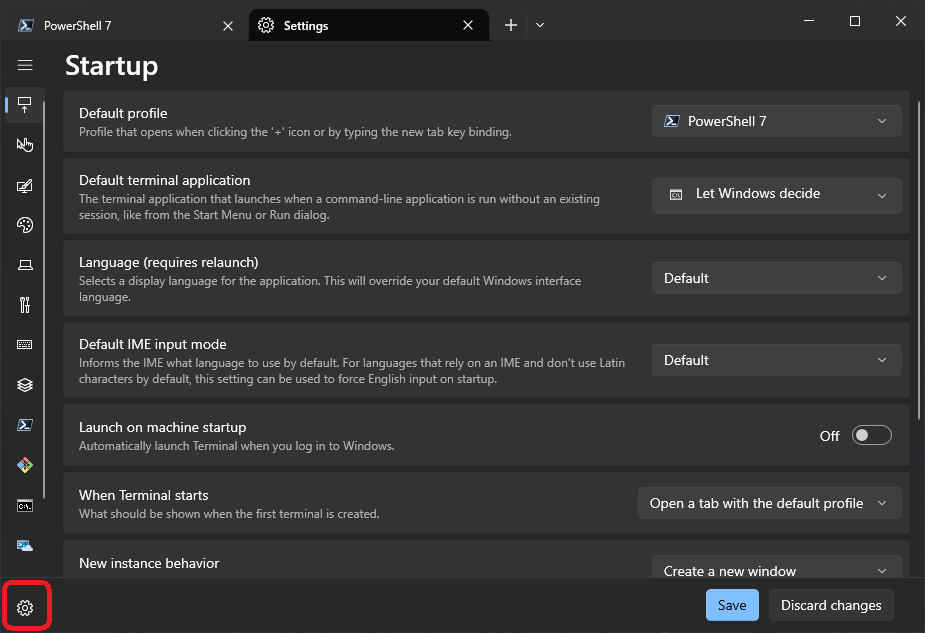

<a href="#quick-setup">Quick Setup</a>

# Windows Terminal Setup

This repository provides configuration files to customize your [Windows Terminal](https://aka.ms/terminal) experience, focusing on a visually appealing and highly functional setup for developers.

## Features

-   **Custom Color Scheme: AP**
    -   A dark, modern color palette designed for readability and aesthetic appeal.
    -   Optimized for use with command-line tools and code editors.

-   **Enhanced Font: JetBrainsMono Nerd Font**
    -   Ensures proper display of special symbols, icons, and ligatures (crucial for tools like Starship).

-   **Pre-configured Profiles Order**
<p align="center">
    
    <br/>
    <em>Profiles Order</em>
</p>

-   **Essential Keybindings**
    -   Convenient shortcuts for common actions: copy, paste, duplicate pane.

-   **Starship Prompt Integration** 
    - Visual setup includes elements from the highly customizable [Starship](../starship) cross-shell prompt (Starship configuration file is managed separately at `~/.config/starship.toml` in your shell environment).

## Files

-   `settings.json`: The main configuration file for Windows Terminal, defining profiles, color schemes, keybindings, and more.

### AP Color Scheme Details

This custom scheme, named "AP", offers a balanced dark background with vibrant accent colors.

| Name                | Hex Code  | RGB Value       |
| ------------------- | --------- | :-------------- |
| background          | `#282C34` | `40, 44, 52`    |
| black               | `#282C34` | `40, 44, 52`    |
| blue                | `#61AFEF` | `97, 175, 239`  |
| brightBlack         | `#6B7280` | `107, 114, 128` |
| brightBlue          | `#61AFEF` | `97, 175, 239`  |
| brightCyan          | `#56B6C2` | `86, 182, 194`  |
| brightGreen         | `#98C379` | `152, 195, 121` |
| brightPurple        | `#C678DD` | `198, 120, 221` |
| brightRed           | `#E06C75` | `224, 108, 117` |
| brightWhite         | `#DCDFE4` | `220, 223, 228` |
| brightYellow        | `#E5C07B` | `229, 192, 123` |
| cursorColor         | `#E5C07B` | `229, 192, 123` |
| cyan                | `#56B6C2` | `86, 182, 194`  |
| foreground          | `#DCDFE4` | `220, 223, 228` |
| green               | `#98C379` | `152, 195, 121` |
| purple              | `#C678DD` | `198, 120, 221` |
| red                 | `#E06C75` | `224, 108, 117` |
| selectionBackground | `#5C6370` | `92, 99, 112`   |
| white               | `#DCDFE4` | `220, 223, 228` |
| yellow              | `#E5C07B` | `229, 192, 123` |

## Screenshots

<p align="center">
    
    <br/>
    <em>"AP" Color Scheme in action.</em>
</p>

<p align="center">
    
    <br>
    <em>PowerShell profile featuring the AP scheme and Starship prompt.</em>
</p>

<a name="quick-setup"></a>

## Quick Setup

Follow these steps to apply the custom configuration to your Windows Terminal:

1.  **Install Windows Terminal:**
-   Download from the [Microsoft Store](https://aka.ms/terminal) or [GitHub](https://github.com/microsoft/terminal/releases).

2.  **Install a Nerd Font:**
-   For proper display of symbols and icons, it's crucial to install a [Nerd Font](https://www.nerdfonts.com/font-downloads).
-   **Recommendation:** [JetBrainsMono Nerd Font](https://www.google.com/search?q=https://github.com/ryanoasis/nerd-fonts/releases/download/v3.2.1/JetBrainsMono.zip) (download the ZIP, extract, right-click `.ttf` files, and select "Install for all users").

3.  **Locate Your `settings.json`:**
-   Open Windows Terminal.
-   Click the dropdown arrow `⌄` (next to the new tab button) and select **Settings** (or press `Ctrl + ,`). Then open your `settings.json` file in your default text editor.
<p align="center">
    
    <br/>
    <em>Starship PowerShell Prompt</em>
</p>

-   **Alternatively**, you can find it manually at: `%LOCALAPPDATA%\Packages\Microsoft.WindowsTerminal_8wekyb3d8bbwe\LocalState\settings.json`


4.  **Integrate the AP Color Scheme:**
-   In your `settings.json`, find the `"schemes"` section. If it doesn't exist, add it as a top-level key.
-   Copy the entire AP color scheme object (the JSON block starting with `{ "background": "#282C34", ... }` and ending after `"yellow": "#E5C07B" }`) from this README.
-   Paste it inside the `schemes` array. Ensure proper JSON syntax (commas between objects if there are multiple schemes).

```jsonc
// Example of 'schemes' section in your settings.json
"schemes": [
    // ... other color schemes you might have ...
    {
        "background": "#282C34",         // RGB: 40, 44, 52
        "black": "#282C34",              // RGB: 40, 44, 52
        "blue": "#61AFEF",               // RGB: 97, 175, 239
        "brightBlack": "#6B7280",        // RGB: 107, 114, 128
        "brightBlue": "#61AFEF",         // RGB: 97, 175, 239
        "brightCyan": "#56B6C2",         // RGB: 86, 182, 194
        "brightGreen": "#98C379",        // RGB: 152, 195, 121
        "brightPurple": "#C678DD",       // RGB: 198, 120, 221
        "brightRed": "#E06C75",          // RGB: 224, 108, 117
        "brightWhite": "#DCDFE4",        // RGB: 220, 223, 228
        "brightYellow": "#E5C07B",       // RGB: 229, 192, 123
        "cursorColor": "#E5C07B",        // RGB: 229, 192, 123
        "cyan": "#56B6C2",               // RGB: 86, 182, 194
        "foreground": "#DCDFE4",         // RGB: 220, 223, 228
        "green": "#98C379",              // RGB: 152, 195, 121
        "name": "AP",
        "purple": "#C678DD",             // RGB: 198, 120, 221
        "red": "#E06C75",                // RGB: 224, 108, 117
        "selectionBackground": "#5C6370",// RGB: 92, 99, 112
        "white": "#DCDFE4",              // RGB: 220, 223, 228
        "yellow": "#E5C07B"              // RGB: 229, 192, 123
    }
],
```

5.  **Set "AP" as Default Color Scheme and Font:**
-   In `settings.json`, navigate to the `"profiles"` section, then `"defaults"`.
-   Set the `"colorScheme"` property to `"AP"` and `"fontFace"` to your installed Nerd Font (e.g., `"JetBrainsMono Nerd Font"`):

```jsonc
"profiles": {
    "defaults": {
        "colorScheme": "AP",
        "fontFace": "JetBrainsMono Nerd Font", // Update with your installed Nerd Font name
        // ... other default settings ...
    },
    // ... individual profile configurations ...
},
```

- **Alternatively, using the UI:** Go to **Windows Terminal Settings \> Defaults \> Appearance**. Under "Color scheme", select **AP**. Under "Font face", select your installed Nerd Font.

6.  **Merge or Replace Profiles (Optional, Advanced):**
-   The provided `settings.json` contains pre-configured profiles (PowerShell, Git Bash, etc.).
-   **Careful:** If you have existing custom profiles, you should **merge** the relevant parts (e.g., specific `guid`, `commandline`, `icon` properties) from this repository's `settings.json` into your own, rather than overwriting your entire file.
-   For a fresh setup, you can replace your `settings.json` with the one from this repository.

7.  **Restart Windows Terminal:** Close and reopen all Windows Terminal windows to apply all changes.

---

Feel free to further customize your `settings.json` to tailor keybindings, profile settings, and more to your personal workflow\!
